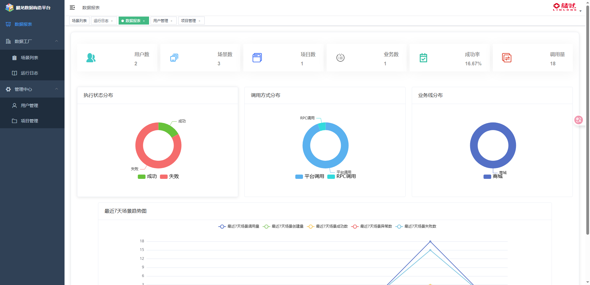
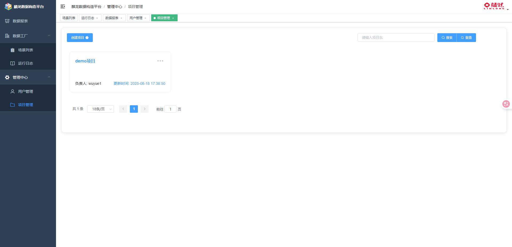

### 🎉 技术栈

- [x] 🎨 Vue2
- [x] 🎶 Element UI
- [x] 🏐 vue-admin-template

### ⚽ 后端地址

[麟龙数据构造平台后端](https://github.com/testerfans/FunDataFactory)

<details open="open">
<summary>🌙 已有功能</summary>

| 功能点            | 状态  |
|:---------------|:----|
| 脚本项目与平台服务解耦  🔥  | ✅  |
| 在线展示测试脚本 🔥      | ✅   |
| 美观的数据报表 🔥       | ✅   |
| http、rpc、get调用 🔥         | ✅   |
| git webhooks同步项目🤤           | ✅   |

</details>

<details>
<summary>平台预览</summary>

#### 🍦 数据报表



#### 场景列表


#### 运行日志


#### 用户管理


#### 项目管理



</details>

### 😢 关于麟龙数据构造平台

#### 为什么需要数据构造平台？

在软件测试过程中，我们经常需要大量的测试数据来验证各种业务场景。传统的测试数据准备方式存在以下问题：

1. **数据准备效率低**：手动创建测试数据耗时费力，容易出错
2. **数据一致性差**：不同测试人员创建的数据格式不统一
3. **数据复用性差**：每次测试都需要重新准备数据
4. **数据管理混乱**：缺乏统一的数据管理和版本控制
5. **测试脚本耦合度高**：测试脚本与数据准备逻辑混合，维护困难

#### 数据构造平台能解决什么问题？

麟龙数据构造平台通过以下方式解决上述问题：

1. **自动化数据生成**：通过脚本化方式自动生成测试数据，提高效率
2. **标准化数据格式**：统一的数据结构和生成规则，确保数据一致性
3. **数据模板复用**：可复用的数据模板，减少重复工作
4. **集中化管理**：统一的数据管理和版本控制
5. **脚本与数据解耦**：将数据构造逻辑与测试脚本分离，提高可维护性

#### 为什么这种方式更优？

相比传统的测试数据准备方式，麟龙数据构造平台具有以下优势：

1. **技术架构优势**：
   - 使用`Python`+`FastApi`+`Vue`开发，前后端分离，扩展性强
   - 采用apidoc自动生成脚本入参出参文档，降低使用门槛
   - 动态导包作为核心执行方法，支持热更新，无需重启服务

2. **用户体验优势**：
   - 提供友好的Web界面，非技术人员也能轻松使用
   - 支持多种调用方式（HTTP、RPC、GET），适应不同场景
   - 实时查看执行日志和结果，便于调试和问题定位

3. **运维管理优势**：
   - 支持Git Webhook自动同步，实现代码与数据的版本控制
   - 提供美观的数据报表，便于数据使用情况分析
   - 完善的权限管理，确保数据安全

麟龙数据构造平台的宗旨：专注于测试脚本的测试工具，用于业务测试提效，让测试数据准备变得简单、高效、可靠。


### 服务器部署
我们只需要在服务器上`git clone`，下载项目并以项目中的dockerfile文件构建镜像

#### 环境配置说明
项目支持开发环境和生产环境的自动配置切换：

- **开发环境**：默认使用本地数据库配置（127.0.0.1）
- **生产环境**：使用服务器数据库配置（172.16.80.125）

环境变量设置：
- `ENV=development`：开发环境（默认）
- `ENV=production`：生产环境

Docker容器会自动设置为生产环境，本地开发时无需修改配置。

#### 前置准备
1. **创建数据库**
```sql
-- 在MySQL中执行以下SQL创建数据库
CREATE DATABASE datafactory CHARACTER SET utf8mb4 COLLATE utf8mb4_unicode_ci;
```

2. **新建server目录
```shell
mkdir /server
cd /server
# 用来目录挂载
mkdir logs
# 用来目录挂载
mkdir keys
```
**备注:** keys目录上传刚才本地创建的公钥和私钥，这里我用的是`FinalShell`软件进行上传，如果不需要ssh拉取git项目，可以忽略创建keys目录


3. 在server目录git clone项目
```shell
cd /server
git clone git@github.com:testerfans/FunDataFactory.git 
git clone git@github.com:testerfans/FunDataFactoryWeb.git
```
4. 分别执行构建镜像
```shell
cd /server/FunDataFactory
docker build -t fun:v1 .
cd /server/FunDataFactoryWeb
docker build -t fun_web:v1 .
```
**备注:** Dockerfile已配置国内包源，构建速度会更快：
- 后端：使用清华大学PyPI镜像源（`https://pypi.tuna.tsinghua.edu.cn/simple/`）
- 前端：使用淘宝npm镜像源（`https://registry.npmmirror.com/`）

如需使用其他国内源，可参考项目中的 `pip.conf` 配置文件。

**启动优化：**
- 使用启动脚本 `start.sh` 进行服务启动前的检查
- 生产环境关闭了代码热重载功能
- 添加了健康检查脚本 `health_check.py`
- 配置了国内包源，加快构建速度
5. 创建并启动容器（示例使用宿主机端口 5001/5002）
```shell
# 后端服务启动（容器内监听 8080 → 宿主机映射 5001）
# 如果不需要ssh拉取git项目，可以忽略挂载keys目录
docker run -itd --name datafactoryserver \
  -p 5001:8080 \
  -v /server/logs:/fun/logs \
  -v /server/keys:/fun/app/commons/settings/keys \
  fun:v1

# 前端服务启动（容器内监听 80 → 宿主机映射 5002）
docker run -itd --name datafactoryweb -p 5002:80 fun_web:v1
```
**备注:** 
- 请在安全组/防火墙放通 5001、5002。
- 前端构建前在 `.env.production` 中设置：`VUE_APP_BASE_API=http://<你的服务器IP或域名>:5001/api`。
- 确保MySQL服务已启动，且容器能访问宿主机MySQL（172.16.80.125:3306）。
- 数据库表结构会在服务启动时自动创建，无需手动建表。


启动成功后，浏览器访问`http://119.91.144.214`，`119.91.144.214`为服务器的ip地址

**容器启动检查：**
```bash
# 查看容器状态
docker ps

# 查看容器日志
docker logs datafactoryserver

# 进入容器进行健康检查
docker exec -it datafactoryserver python health_check.py
```

**故障排除：**
如果容器启动失败，可以尝试以下步骤：

1. **检查容器状态和日志：**
```bash
# 查看容器状态
docker ps -a

# 查看容器日志
docker logs datafactoryserver

# 进入容器检查
docker exec -it datafactoryserver bash
```

2. **检查数据库连接：**
```bash
# 检查MySQL服务状态
systemctl status mysql

# 检查MySQL是否允许远程连接
mysql -u root -p -e "SELECT user, host FROM mysql.user WHERE user='root';"

# 如果需要，允许root用户远程连接
mysql -u root -p -e "UPDATE mysql.user SET host='%' WHERE user='root'; FLUSH PRIVILEGES;"
```

3. **检查网络连接：**
```bash
# 测试网络连通性
ping 172.16.80.125
telnet 172.16.80.125 3306
```

**常见问题：**
- MySQL服务未启动
- MySQL不允许远程连接
- 防火墙阻止连接
- 数据库不存在
- 用户名密码错误
- 前端API配置错误

6. Nginx转发代理(非必须)

如果已经申请了域名，可以给机器配上个域名，这样子就不用每次直接`ip+端口`访问，方便很多，如果没有申请域名，可忽略第5步···
```
worker_processes  1;
events {
    worker_connections  1024;
}

http {
    include       mime.types;
    default_type  application/octet-stream;
    sendfile        on;
    keepalive_timeout  65;
    server {
        listen       80;
        server_name  fangfun.xyz;
        location / {
          proxy_set_header   X-Real-IP $remote_addr;
        	proxy_set_header   Host      $http_host;
        	proxy_pass         http://0.0.0.0:5002;
        }
        error_page   500 502 503 504  /50x.html;
        location = /50x.html {
            root   html;
        }
    }
	server {  
    		listen 80;
    		server_name api.fangfun.xyz;
    		location / {
        		proxy_set_header   X-Real-IP $remote_addr;
        		proxy_set_header   Host      $http_host;
        		proxy_pass         http://0.0.0.0:5001;
    }
}
}
```
这里的`fangfun.xyz`直接映射到了本地的`5002`端口即为前端服务，
`api.fangfun.xyz`为二级域名，直接映射到了本地的`5001`端口即为后端服务

**备注:**前端镜像启动时，映射宿主机的端口为`81`

```shell
# 前端服务启动
docker run -itd --name datafactoryweb -p 5002:80 fun_web:v1
```

### 😊 已有功能

+ [x] 🔥 git webhook 同步项目
- [x] 🀄 在线展示测试脚本
* [x] 🚴 丰富的调用方式（http、rpc、get调用）
- [x] 💎 美观的数据报表